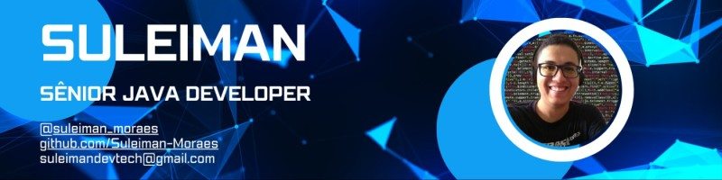

<h5 align="center">Olá, Seja bem vindo!</h5>
<h1 align="center">Meu nome é Suleiman Moraes 👨🏿‍💻 </h1>

    <a href="https://github.com/Suleiman-Moraes">
        
        

 
    
    
    
    
    
    
    
    
    
    
    

    

##

 
    <!--  -->
    
    
    

---

<h2> :blue_book: Sobre</h2>

 Suleiman Alves de Moraes is a professional graduated in Analysis and Systems Development from the renowned institution SENAI Fatesg. His professional journey is marked by an unwavering commitment to excellence and a genuine enthusiasm for solving complex problems.

With a warm and welcoming approach, Suleiman demonstrates exceptional skills in building interpersonal relationships. His willingness to cultivate meaningful connections within and outside the workplace reflects his commitment to a collaborative and positive environment. His resolute stance towards conflicts, coupled with his aversion to fruitless arguments, evidences remarkable professional maturity.

In the work context, Suleiman stands out for his tireless dedication and willingness to tackle challenges head-on. His proactivity is evident in his readiness to explore new technologies and deepen his knowledge, often investing his personal time in additional studies to better serve the company's goals.

A true enthusiast of development, Suleiman not only embraces assigned tasks but also constantly seeks ways to raise the standard of quality and efficiency. Whether proposing innovative solutions, introducing new design standards, or refining existing ones, his passion for the art of software development transcends the boundaries of the profession, revealing itself as an intrinsic part of his identity.

At the core of his professional journey, Suleiman finds satisfaction in the ability to turn abstract concepts into tangible reality. His commitment to technical excellence and results-oriented mindset distinguish him as a valuable asset in any development team.

In summary, Suleiman Alves de Moraes epitomizes the modern professional who not only embraces the challenges of technology but also confronts them with unwavering determination and a positive attitude. His relentless pursuit of innovation and his ability to inspire and collaborate with others highlight him as a driving force at the forefront of system development.

---

